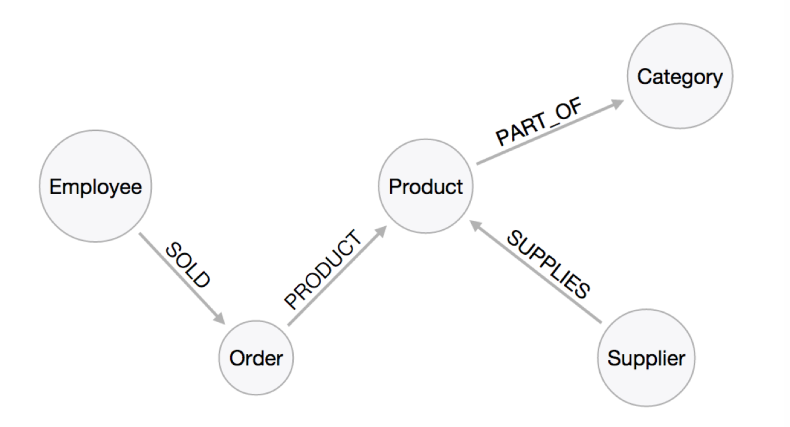

# CYPHER Query language

- declarative
- open standard, initiated by Neo Inc.
- used to query, insert, update and delete
- visual and logical syntax to match patterns in a graph
- familiar terms from SQL: WHERE, ORDER BY, SKIP LIMIT, AND, p.unitPrice > 10

## Query the graph - MATCH

- Match patterns in your graph
- Use circle notation to define entities `(p:Product)`
- Use arrow notation to define relationships `-->` and types in brackets `-[:ISSUE]->`
- `(cust:Customer)-[:ISSUED]->(o:Order)`

## Examples



## Examples with SQL equivalent - 1

```sql
SELECT p.*
FROM products as p;
```

```cypher
MATCH (p:Product)
RETURN p;
```
## Examples with SQL equivalent - 2

```sql
SELECT p.ProductName, p.UnitPrice
FROM products as p
ORDER BY p.UnitPrice DESC
LIMIT 10;
```

```cypher
MATCH (p:Product)
RETURN p.productName, p.unitPrice
ORDER BY p.unitPrice DESC
LIMIT 10;
```

## Example with SQL equivalent - 3

Find all employees that sold a *Chocolate*?

```
MATCH (p:Product {productName:"Chocolate"})<-[:PRODUCT]-(:Order)<-[:SOLD]-(e:Employee)
RETURN distinct e.name;
```

## Create an index

```
MATCH (p:Product)
WHERE p.productName = "Chocolate"
RETURN p;
```

Create index on property to improve query speed.

```
CREATE INDEX ON :Product(productName);
```
