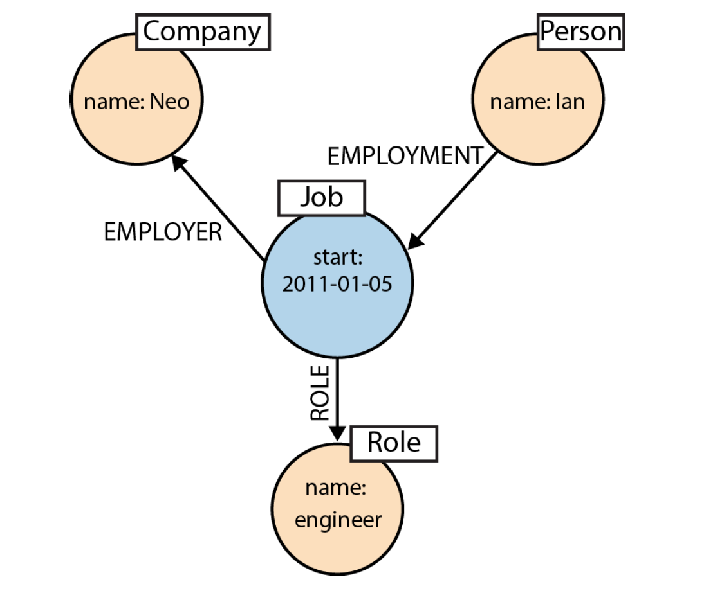
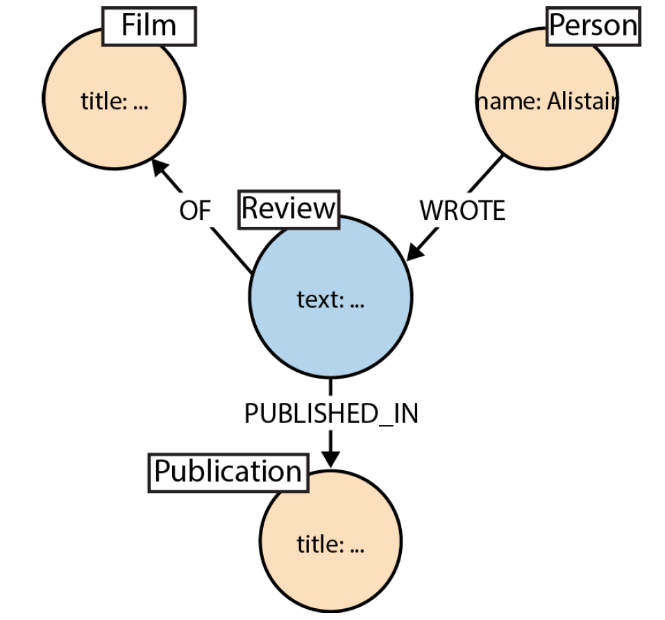

# Labeled Property Graph Model

- nodes
- directed relationships
- properties
- labels
- **Describe the model in terms of application needs**

## Nodes

- Contain properties, which are entity attributes and metadata, such as timestamps, version numbers
- Are documents that store properties in the form of arbitrary key-value pairs. Similar to a document store.
- Nodes can be labeled. Labels group nodes together, and indicate the roles they play within the dataset. e.g. electric vs gas-powered cars

### Model facts as nodes

- Represent the outcome of an interaction between two nodes as a node
- Act of Alistair reviewing a film can be represented in the
graph.

- Multi-property fields, such as review make sense to represented as a node.

### Property vs label

- Nodes can have properties or labels to describe an entity
- A car has has a model, a brand, a price, available colors,...
- Model your graph depending on your applications questions?
- available colors => property (not likely to be queried)
- Model -> could be represented as a label, as you might want to answer many questions about the model.
- Properties take less space to save, but are a bit slower to query for.

## Relationships

- Relationships connect nodes and structure the graph.
- No dangling relationships
- A relationship has a direction and a name.
- A relationship can have properties as well. Especially important for graph traversal algorithms. (e.g. distance between two cities)

### Fine grained vs. general relationships

- DELIVERY_ADDRESS and HOME_ADDRESS versus ADDRESS {type:'delivery'} and ADDRESS {type:'home'}
- Reduce the lookup size by specific relationship names
- Property value lookup adds extra IO
- Properties work well to define weights (e.g. distance between two cities)
- It is also possible to have more relationships at the same time like DELIVERY_ADDRESS and ADDRESS {type:'delivery'}

## Storage

- **Adjacency matrix**: Quadratic matrix/table -> very sparse data and huge memory footprint (nodes x nodes)
- **Incidence matrix**: Nodes horizontally, relationships vertically,  for each incident set the corresponding field -> very large footprint
- **Edge list**: Save pairs of nodes -> (n1, n2), (n3,n1)
- **Adjacency list**: Builds on top of the idea from the *Edge list*. For every node, save the relations in a list. n1(n2,n3), n2(n1), n3(n1). This method supports lookups without extra indices.

## Storage model of Neo4j

Nodes, relationships, properties and labels are stored in different files

### Node storage

Every node is defined by 15 bytes

[0, 1..4, 5..8, 9...13, 14]

- 0: in_use flag => tells neo4j if this record is filled with data
- 1..4 => id of the first relationship
- 5..8 => id of the first property
- 9...13 => pointer to the label store for this node
- 14: *extra* byte reserved for flags

### Relationship storage

- Each relationship record contains the IDs of the nodes at the start and end of the relationship.
- a pointer to the relationship type 
- pointers for the next and previous relationship
records for each of the start and end nodes

