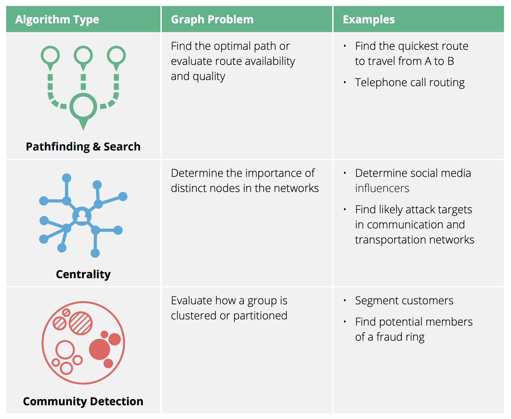
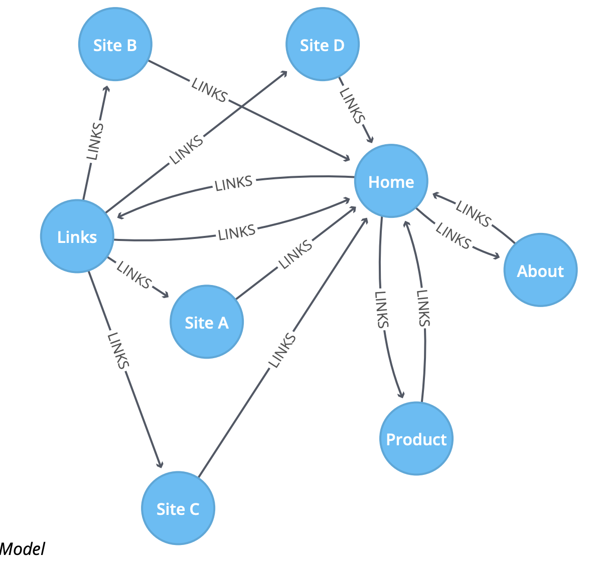

# Advanced Graph traversal



## Example of PageRank

PageRank is named after Google co-founder Larry Page and is used to rank websites in Google’s search results. It counts the number, and quality, of links to a page, which determines an estimation of how important the page is.



```
CALL algo.pageRank.stream("Page", "LINKS",
{iterations:20})
YIELD nodeId, score

MATCH (node) WHERE id(node) = nodeId

RETURN node.name AS page,score
ORDER BY score DESC
```

